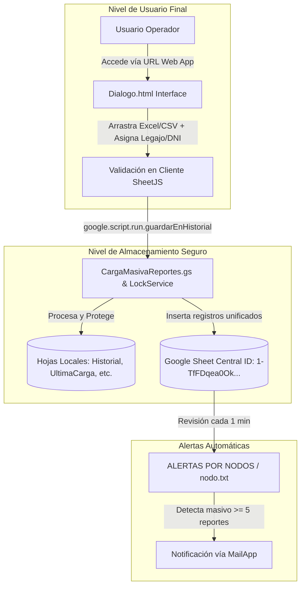

# 🚀 Proyecto Nodos TECO (Carga Masiva y Monitoreo de Nodos)

Sistema de automatización en **Google Apps Script (GAS)** para la carga masiva, estandarización de reportes de servicio, mapeo de equipos, almacenamiento local/remoto y monitoreo automático de concentraciones/masivos en nodos de red.

---

## 🔒 Arquitectura de Seguridad (Formulario Web Aislado)

Para evitar otorgar acceso directo a la Planilla de Google Sheets (previniendo modificaciones accidentales o exposición indebida de datos), el sistema expone un **Formulario Web (`Dialogo.html`)** vía Web App (`doGet`). Los usuarios finales cargan la información a través de esta interfaz segura sin interactuar directamente con las celdas de la planilla.



---

## 🗂️ Estructura de Archivos y Módulos

| Archivo | Descripción | Estado |
| :--- | :--- | :--- |
| **`Dialogo.html`** | Interfaz web responsiva para usuarios. Drag & Drop de archivos Excel/CSV, pre-validación de columnas, asignación masiva de Legajo/DNI y tabla de vista previa con mapeo de servicios en vivo. | **En Desarrollo (`dev`)** |
| **`CargaMasivaReportes.gs`** | Backend Apps Script con `doGet(e)` para servir el Web App, validación de estructura, mapeo de servicios (`HFC`, `Flow`, `FTTH`) y guardado seguro con `LockService`. | **En Desarrollo (`dev`)** |
| **`nodo.txt`** | Algoritmo de evaluación de masivos por nodo, filtrado por antigüedad (`MAX_LOOKBACK_HOURS`) y deduplicación con `PropertiesService`. | **Producción** |
| **`ALERTAS POR NODOS (EJECUCIÓN MINU.txt`** | Configuración de triggers temporales, ventana de bloqueo nocturno (00:59–03:00) y limpieza diaria. | **Producción** |
| **`README.md`** | Documentación técnica y arquitectura de seguridad del proyecto. | **Documentación** |

---

## ⚙️ Funcionalidades Clave

### 1. Formulario Web de Carga Segura (`Dialogo.html`)
* **Drag & Drop**: Soporta archivos `.xlsx`, `.xls` y `.csv`.
* **Validación en Cliente**: Comprueba la presencia de las 12 columnas requeridas (`MAC`, `ABONADO`, `ALTURA`, `CALLE`, `AREA SERVICE`, `MODELO`, `CALI F_CPE_SCORE`, `LOCALIDAD`, `PROVINCIA`, `IP`, `TIP O_DOMIC`, `NU M_SERIAL_EQUIPO`) antes de enviar al servidor.
* **Mapeo Visual en Vivo**: Detecta el modelo de cada fila y muestra badges de color para `Internet HFC`, `Flow` o `Internet FTTH`.
* **Carga Masiva de Operador**: Permite fijar con un solo clic el legajo/código de usuario y DNI a todos los registros del lote.

### 2. Mapeo Modelo → Servicio (`CargaMasivaReportes.gs`)
* **Internet HFC**: `FAST389615`, `CGA4233TAR`, `FAST3890V3`, `CGA4233TCH3`, `CG3000`, `DPC3848VET`, `FAST3686V2`, `DPC3848VE`, `FAST3686`.
* **Flow**: `HP4CH`, `B866V6N`, `ZXV10`, `DIW250`, `HP44`, `HP40`, `VSB3918`, `DIW362UHDV2`, `DIW360`, `DCX-4400`, `DCX-4220`.
* **Internet FTTH**: `HG8145X610`, `HG8245W58Tv2`, `HG8245U`, `FAST5657`, `G1426GD`, `G240WJ`, `G2425GB`, `G240WB`, `PPV4439B`, `PRV33AX349B`.

---

## 🌿 Estrategia de Ramas Git (Branching Strategy)

```
main (Producción estable)
  └── dev (Rama activa para desarrollo de la interfaz Web App y mejoras)
```

* **`main`**: Código de producción probado y estable.
* **`dev`**: Rama activa de desarrollo donde trabajamos la nueva interfaz HTML sin interferir con el entorno de producción.

---

## 🛠️ Comandos Git de Uso Frecuente

* **Ver estado actual**:
  ```bash
  git status
  ```
* **Guardar cambios en la rama `dev`**:
  ```bash
  git add .
  git commit -m "feat: interfaz web Dialogo.html y soporte Web App doGet"
  ```
* **Volver a producción (`main`)**:
  ```bash
  git checkout main
  ```
* **Publicar cambios de `dev` a `main` (Merge)**:
  ```bash
  git checkout main
  git merge dev
  ```
