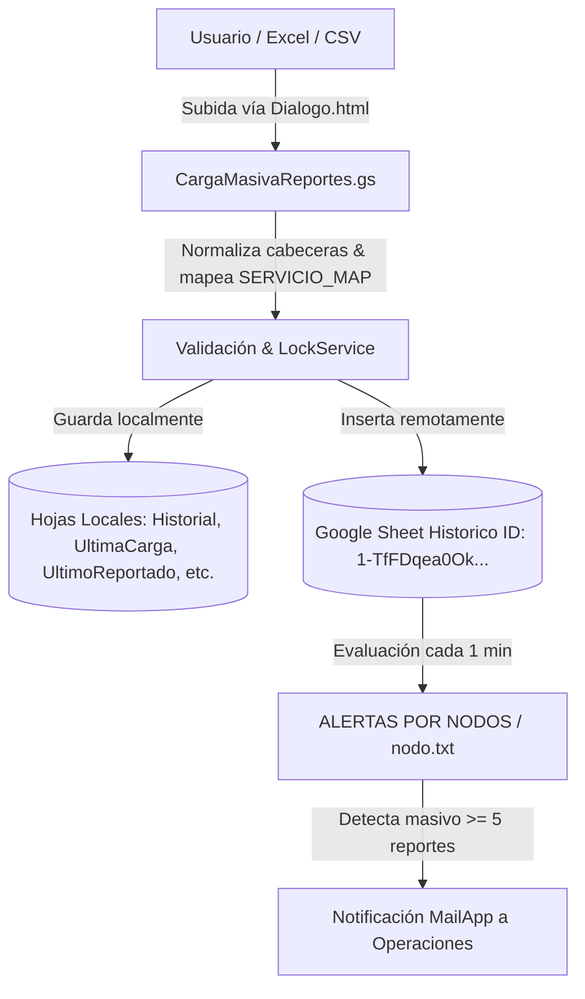

# 🚀 Proyecto Nodos TECO (Carga Masiva y Monitoreo de Nodos)

Sistema de automatización en **Google Apps Script (GAS)** para la carga masiva, estandarización de reportes de servicio, mapeo de equipos, almacenamiento local/remoto y monitoreo automático de concentraciones/masivos en nodos de red.

---

## 📐 Arquitectura General del Sistema



---

## 🗂️ Estructura de Archivos y Módulos

| Archivo | Descripción | Estado |
| :--- | :--- | :--- |
| **`CargaMasivaReportes.gs`** | Módulo de UI (`onOpen`), parseo tolerante de columnas, mapeo de modelos a servicios (`HFC`, `Flow`, `FTTH`), filtrado de filas vacías y guardado concurrente con `LockService`. | **Producción** |
| **`nodo.txt`** | Algoritmo de evaluación de masivos por nodo, filtrado por antigüedad (`MAX_LOOKBACK_HOURS`), deduplicación con `PropertiesService` y construcción del cuerpo HTML del correo. | **Producción** |
| **`ALERTAS POR NODOS (EJECUCIÓN MINU.txt`** | Configuración de triggers temporales, ventana de bloqueo nocturno (00:59–03:00) y tareas de limpieza diaria. | **Producción** |
| **`README.md`** | Documentación técnica del proyecto y guía de ramas. | **Documentación** |

---

## ⚙️ Funcionalidades Clave

### 1. Mapeo Inteligente Modelo → Servicio
Convierte automáticamente los modelos de equipos (`CPE`/`STB`) a su servicio correspondiente:
* **Internet HFC**: `FAST389615`, `CGA4233TAR`, `FAST3890V3`, `CGA4233TCH3`, `CG3000`, `DPC3848VET`, `FAST3686V2`, `DPC3848VE`, `FAST3686`.
* **Flow**: `HP4CH`, `B866V6N`, `ZXV10`, `DIW250`, `HP44`, `HP40`, `VSB3918`, `DIW362UHDV2`, `DIW360`, `DCX-4400`, `DCX-4220`.
* **Internet FTTH**: `HG8145X610`, `HG8245W58Tv2`, `HG8245U`, `FAST5657`, `G1426GD`, `G240WJ`, `G2425GB`, `G240WB`, `PPV4439B`, `PRV33AX349B`.

### 2. Gestión de Hojas Locales
El script garantiza la existencia y protección de 5 hojas principales:
* **`Historial`**: Registro histórico completo alineado a `ENCABEZADOS_HISTORIAL`.
* **`UltimaCarga`**: Copia exacta únicamente del último lote subido.
* **`UltimoReportado`**: Formato comprimido de 12 columnas enviado al sistema central.
* **`RegistroCargas`**: Log de transacciones (Fecha, Usuario, Mail, Archivo, Registros, Estado).
* **`UltimoResumen`**: Métricas de cantidad agrupadas por `AREA SERVICE` (Nodo) y `ESTADO`.

### 3. Integración Externa
Inserta los registros formateados en el libro de destino remoto:
* **ID de Planilla Destino**: `1-TfFDqea0OkGlQrQdls_3NxMqlQrK8HMieGwPWdLvIo`
* **Hoja Destino**: `Historico`

---

## 🌿 Estrategia de Ramas Git (Branching Strategy)

Para proteger la versión de producción activa de cualquier interrupción durante el desarrollo de la nueva mejora, el repositorio utiliza la siguiente estructura de dos ramas principales:

```
main (Producción estable)
  └── feature/desarrollo-mejora (Rama activa para desarrollo de nuevas funciones)
```

* **`main` / `production`**: Código probado y listo para correr en el entorno de producción.
* **`feature/desarrollo-mejora`**: Rama aislada de desarrollo donde se aplicarán y probarán los nuevos cambios sin alterar producción.

---

## 🛠️ Comandos Git Útiles para la Gestión de Ramas

* **Ver rama actual y estado**:
  ```bash
  git status
  ```
* **Cambiar a la rama de producción**:
  ```bash
  git checkout main
  ```
* **Cambiar a la rama de desarrollo**:
  ```bash
  git checkout feature/desarrollo-mejora
  ```
* **Guardar cambios en la rama de desarrollo**:
  ```bash
  git add .
  git commit -m "feat: descripción de la mejora"
  ```
* **Integrar desarrollo a producción (Merge)**:
  ```bash
  git checkout main
  git merge feature/desarrollo-mejora
  ```
