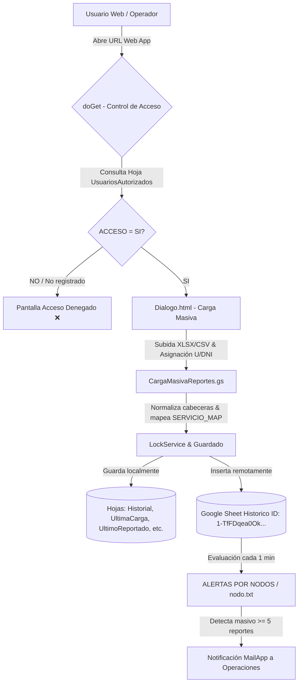

# 🚀 Proyecto Nodos TECO (Carga Masiva y Monitoreo de Nodos)

Sistema de automatización en **Google Apps Script (GAS)** para la carga masiva, estandarización de reportes de servicio, mapeo de equipos, almacenamiento local/remoto, control de acceso dinámico por planilla y monitoreo automático de concentraciones/masivos en nodos de red.

---

## 📐 Arquitectura General del Sistema

---

## 🗂️ Estructura de Archivos y Módulos

| Archivo | Descripción | Estado |
| :--- | :--- | :--- |
| **`CargaMasivaReportes.gs`** | Backend Apps Script con gestión dinámica de permisos desde la hoja `UsuariosAutorizados` (`MAIL` y desplegable `ACCESO` SI/NO), helper `getAppSpreadsheet()`, mapeo de modelos a servicios e integración concurrente con `LockService`. | **Producción** |
| **`Dialogo.html`** | Interfaz Web/Modal responsiva con animación overlay modal (`#loadingOverlay`), reseteo en caliente de formulario y validación dinámica de Identificador (DNI) y Código U. | **Producción** |
| **`nodo.txt`** | Algoritmo de evaluación de masivos por nodo, filtrado por antigüedad (`MAX_LOOKBACK_HOURS`), deduplicación con `PropertiesService` y envío de notificaciones. | **Producción** |
| **`ALERTAS POR NODOS (EJECUCIÓN MINU.txt`** | Configuración de triggers temporales, ventana de bloqueo nocturno (00:59–03:00) y tareas de limpieza diaria. | **Producción** |
| **`DOCUMENTACION_PROYECTO.md`** | Documentación técnica completa y especificación detallada del proyecto. | **Documentación** |
| **`README.md`** | Resumen de arquitectura y guía técnica general. | **Documentación** |

---

## ⚙️ Funcionalidades Clave

### 1. Gestión Dinámica de Accesos desde la Planilla (`UsuariosAutorizados`)
* Hoja administrable con 2 columnas: **`MAIL`** y **`ACCESO`** (desplegable `SI` / `NO`).
* Permite dar de alta nuevos correos agregándolos con `SI` o revocar accesos cambiando la selección a `NO`.
* Restringe el acceso de forma inmediata al abrir la URL de la Web App.

### 2. Overlay Modal y Reseteo sin Recargar
* Ventana modal flotante con estado visual animado durante la subida e integración de datos.
* Reseteo fluido de estado tras completar la carga sin requerir recargar la página Web.

### 3. Mapeo Inteligente Modelo → Servicio
* **Internet HFC**: `FAST389615`, `CGA4233TAR`, `FAST3890V3`, `CGA4233TCH3`, `CG3000`, `DPC3848VET`, `FAST3686V2`, `DPC3848VE`, `FAST3686`.
* **Flow**: `HP4CH`, `B866V6N`, `ZXV10`, `DIW250`, `HP44`, `HP40`, `VSB3918`, `DIW362UHDV2`, `DIW360`, `DCX-4400`, `DCX-4220`.
* **Internet FTTH**: `HG8145X610`, `HG8245W58Tv2`, `HG8245U`, `FAST5657`, `G1426GD`, `G240WJ`, `G2425GB`, `G240WB`, `PPV4439B`, `PRV33AX349B`.

### 4. Gestión de Hojas Locales y Remotas
* **`Historial`**: Almacén acumulativo de cargas.
* **`UltimaCarga`**: Espejo únicamente del último archivo subido.
* **`UltimoReportado`**: Matriz unificada de 12 columnas.
* **`RegistroCargas`**: Bitácora de transacciones.
* **`UltimoResumen`**: Métrica por nodo y estado.
* **`UsuariosAutorizados`**: Control de permisos con desplegable `SI`/`NO`.
* **`Historico` (Externa)**: Inserción directa en la planilla principal `1-TfFDqea0OkGlQrQdls_3NxMqlQrK8HMieGwPWdLvIo`.

---

## 👨‍💻 Autoría y Créditos
- **Desarrollado por**: Lautaro Padin
- **Impulsado por**: Nodos MERM
